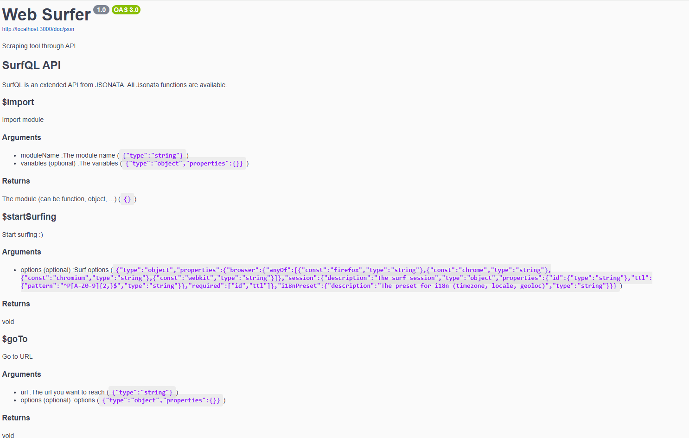

<p align="center">
    
  <h1 align="center">Web Surfer</h1>
</p>

## Description

Web-Surfer is a webservice to automate (ex scrape) web surfs.

### Launch

```sh
npm i
sudo docker compose up
```

### Test

You can use the command :

```sh
# Pre-requise : Running service (ex npm start)
npm run build # Build surf-cmd
npm run serve-lib # Start a server to serve libs (for imports tests)
node dist/surf-cmd.js --surf-api 'http://localhost:3000' tests/doctolib.yaml --url 'https://www.doctolib.fr/chirurgien-visceral-et-digestif/le-blanc-mesnil/nouredine-oukachbi/booking/availabilities?specialityId=179&telehealth=false&placeId=practice-5105&motiveIds%5B%5D=860154&pid=practice-5105'
```

This will returns the availabilities for your doctor for the next 15 days :
```javascript
// Launch date 2024-12-22 21:20+01:00
[
  '2024-12-24 09:40',
  '2024-12-24 11:30',
  '2024-12-26 15:00',
  '2024-12-26 15:10',
  '2024-12-26 15:20',
  '2024-12-26 15:50',
  '2024-12-26 16:00',
  '2024-12-26 16:30',
  '2024-12-26 16:40'
]
```

## POST /surf with SurfQL

- Hight level API with functions, with simple naming like human actions (I go to, I click on, I fill, I read something, etc)
- (not available) Low level API with object returned by $startSurfing()

### Example : Search on Google, extract a text and take a screenshot

```javascript
{
    expression: `

        $goTo('https://www.google.fr');

        $clickOn('button:has-text("Tout accepter")');

        $fill('textarea[aria-label="Rech."]', 'Trump', { 'pressEnter': true });

        {
            'description': $readText('[data-attrid=description] div > span:nth-child(2)'),
            'screenshot': $screenshot()
        };

    `
}
```

We will receive a JSON with a description (an extracted text) and a sreenshot base64 encoded.

### Example : Extract and transform Gaz consumption from GRDF

```javascript
{
    input: {
        compteur,
        email,
        _password
    },
    expression: `

        $start := $date().subtract(10, 'days').format('YYYY-MM-DD');
        $end := $date().format('YYYY-MM-DD');

        $startSurfing({'session': {'id': 'grdf', 'ttl': 'P1D'}});

        $goTo('https://monespace.grdf.fr/');

        $login := function() {(
            $debug('Login');
            $fill('[name="identifier"]', email, { 'pressEnter': true });
            $fill('[name="credentials.passcode"]', _password, { 'pressEnter': true });
        )};

        $contains($readUrl(), 'connexion.grdf.fr') ? $login() : $debug('Already logged');

        $goTo($buildUrl(
            'https://monespace.grdf.fr/api/e-conso/pce/consommation/informatives?dateDebut={start}&dateFin={end}&pceList%5B%5D={compteur}',
            { 'start': $start, 'end': $end, 'compteur': compteur }
        ));

        $resultConso := $eval($readText('body'));

        $resultConso.*.releves.{'date': journeeGaziere, 'kwh': energieConsomme};
    `
}
```

We explicity create a surfing session with a 1day validity, login to GRDF if needed, fetching consumption and transforming it to obtain exactly what we want.

Here an output example :
```javascript
[
  { date: '2024-11-27', kwh: 12 },
  { date: '2024-11-28', kwh: 2 },
  { date: '2024-11-29', kwh: 6 },
  { date: '2024-11-30', kwh: 12 },
  { date: '2024-12-01', kwh: 14 },
  { date: '2024-12-02', kwh: 10 },
  { date: '2024-12-03', kwh: 13 },
  { date: '2024-12-04', kwh: 15 }
]
```

### Example : Use imports

http://trusted.com/shared-surfs.json

```javascript
{
    search: {
        schemas: {
            input: {
                type: 'object',
                properties: {
                    url: {
                        type: 'string'
                    },
                    query: {
                        type: 'string'
                    }
                },
                required: [
                    'url',
                    'query'
                ]
            },
            output: {
                type: 'object',
                properties: {
                    description: {
                        type: 'string'
                    },
                    screenshot: {
                        type: 'object'
                    }
                },
                required: [
                    'description',
                    'screenshot'
                ]
            }
        },
        input: {
            url: 'https://www.google.com'
        },
        expression: `
            $goTo(url);
            $clickOn('button:has-text("Tout accepter")');
            $fill('textarea[aria-label="Rech."]', query, { 'pressEnter': true });

            {
              'description': $readText('[data-attrid=VisualDigestDescription] div:nth-child(2) > span:nth-child(1)'),
              'screenshot': $screenshot()
            }

        `
    }
}
```

Our surf :

```javascript
{
    input: 'hello world',
    expression: `

        $call('http://trusted.com/shared-surfs.json#/search', {
            'url': 'https://www.google.fr',
            'query': $
        }).description

    `
}
```

Tadaaaa ! We can reuse code. It is also possible to export functions, but the logic of input/expression/output is recommanded.

## startSurfing

High functions will use the last found resources of the surf. If not found, they will be created. To explicit them, you can declare your surfing. For example (everything is optionnal) :
```
$startSurfing({
    'browser': 'firefox',
    'session': {'id': 'abc', 'ttl': 'P1M'},
    'timezone': 'Europe/Madrid',
    'locale': 'es_ES'
});
 ```

 i18nPreset allows to give a preset (alias) of a set of internationalization params, including timezone, locale, proxy, etc.

 StartSurfing can be called several times in the same surf. A Surfing context is created (and pages will be created then).

## Notes

SurfQL is on top of JSONATA (input -> transformation -> output). Browsers are managed by Browserless (warning to the licence), but it should be good to have an opensource alternative with minimum firefox and chrome and autostart and garbage system, drived by playwright.

For output, Web Surfer will choose the content type (json/plain/image/etc) depending of the returned value. To force the type, use Accept http header. To force binary encoding (in case of json for example), use explicit method (ex $base64) (or header ?)

Cases :
- Output is string : text/plain
- Output is Buffer : identify the type and returns raw data
- Output is object/boolean : application/json

When output contains string (text/plain or application/json), binary data will be represented as base64 by default.

## Todo

- Use https://github.com/Kaliiiiiiiiii-Vinyzu/patchright ?
- Native Yaml support
- Global Registry and/or user registry
- Direct http call without browser
- Ability to call with GET with CORS allow -> need URL token (jwt ?) to exec it
- Cache ?
- Resolve import on $call call instead of init, with ability to refer to the same "document"
- Add URI sha1 check to ensure a resource has not changed ? Or another way to manage contracts/trust ?
- Add contracts zod for inputs/output, etc
- Use @gallolabs/application on top
- Create Browserless alternative for the need
- Replace Typebox by Zod ?


## Help

Go to http://localhost:3000/doc for OpenAPI doc with surfQL available methods.


